# Editing a TeX document

## Creating a new document

There are two different ways to create a new document that are described
in the following subsections:

### Setting the preamble of a TeX document

To define the preamble of your document, you can use the \"Quick start\"
wizard (\"Wizard\" menu).

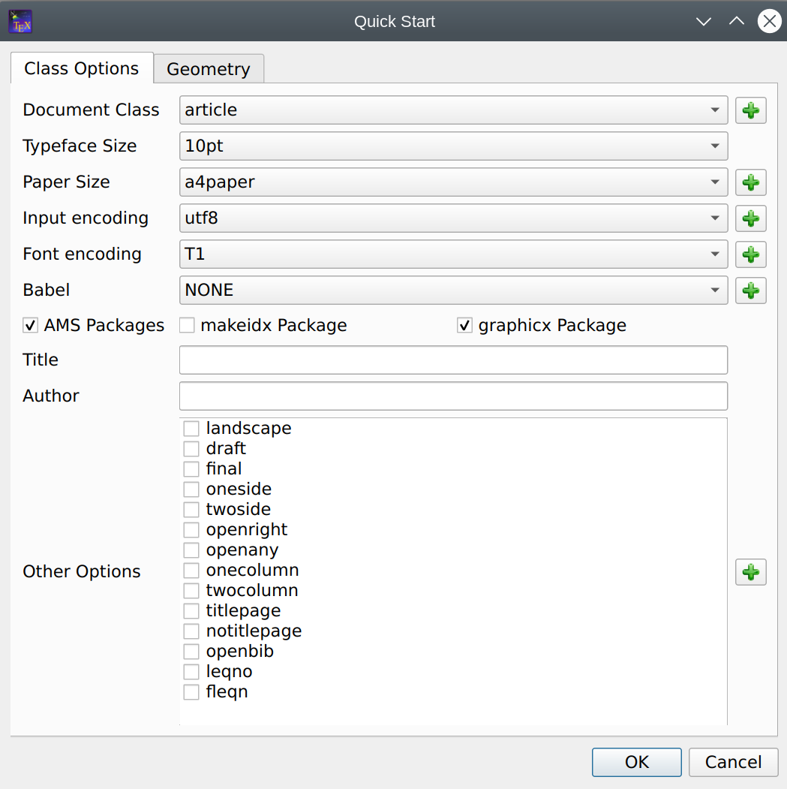

This dialog allows you to set the main features of your document (class,
paper size, encoding\...).
Note : You can add other options by clicking the \"+\" buttons. All your
settings are recorded.

You can also type your own preamble model in the editor : with the
\"Copy/paste\" or \"Save As\" commands, you can use it for a new
document.

### Using Templates to start a new document

For new documents, templates can be used by using the command \"File/New
from template\". A dialogue gives a selection of templates.

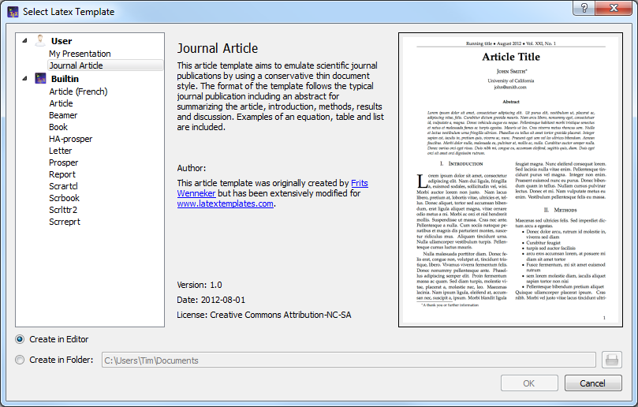

You can either create a new editor document from the template or create
it as file(s) on disk and open these in the editor. The former option is
not available for multi-file templates.

New templates can be created by using the command \"File/Make Template\"
on a opened document which you like to have has a template. Note that
this dialog currently does not support the full capabilities of the
template system. In particular you cannot supply a preview image or
create a multi-file template with it. You\'ll have to do this manually
(s. [The template format](background.md#the-document-template-format) below).

User added templates can be edited or deleted by using the context menu
in the template selection dialogue. Built-in templates can not be
changed.

User templates are saved in the `/templates/user/` subdirectory of the
config directory.

## Structure your document

To define a new part in your document (part, section, subsection, \...)
with TeXstudio, just use this combo box button in the format toolbar of
the main toolbar:


## Browsing your document

### The Structure View

The \"Structure View\" (left panel) lets you quickly reach any part of
your document. All you need to do is to click on any item (label,
section\...) and you will be taken to the beginning of the corresponding
area in the editor. The mechanism for jumping to a line does not anymore
only consider line numbers but really remembers text lines. Thus adding
and removing lines will not lead to jumps to wrong locations.

A light-blue background shows the present cursor position in the text in the
structure view as well. A greenish background denotes sections which are
in the appendix.


The \"Structure View\" is automatically updated as you type. You can
also use the \"Refresh Structure\" (menu \"Idefix\") command at any
moment.

The structure view shows labels, sections, includes and beamer blocks
and todos.

There are two kind of todos that will be listed a) todos from a
todo-like command, e.g. \\todo{} from the package todonotes. b)
todo-comments: This is a comment with a \"% TODO\" or \"%todo\". You can
adapt the regular expression for other comments to be marked as
todo-comment in *options/advanced editor/Regular Expression for TODO
comment*, e.g \"%\\s?\[A-Z\]\[A-Z\_\\-\]+\" for any comment starting
with at least two capital letter only comment.

The structure view also offers a context menu which allows one to
copy/cut all text which belongs to a section (including subsection) and
paste it before or after a section. Section can be indented/unindented
which means that the hierarchy level is changed by one, i.e. \\section
is changed to \\subsection, and all subsections are treated accordingly

### The TOC View

The side panel on the left offers a TOC view. The TOC shows the structure of your
whole document by means of section commands (part, section, subsection,
...). A mouse over shows you, in which file the section actually is.


The image shows this: A root file named document.tex that includes the
file named file1.tex. The root file contains the section „Main text",
while file1.tex contains the subsection „External". By placing the mouse
pointer over this subsection in the TOC view, you find the file name
file1.tex in the mouse over. This works even if the file is not open
(but the document must be loaded by TeXstudio, s. Automatically load
included files in editor settings). In this case a mouse click on the
subsection in the TOC will open the file for you. Notice the different
shades of color that indicate the sections are in different files. It
can happen, that an included file doesn't contain any sections. Then the
file name itself appears in the TOC (without file extension):


The mouse over now would show the name of the file that includes
file1.tex (namely document.tex). The indentation shows that the text of
file1.tex is part of the section "Main text". You may like to choose a
different color in the configuration dialog (s. option Use color in
global TOC in [advanced editor settings](configuration.md#configuring-the-advanced-editor-settings-advanced-option)).

### Using Bookmarks

You can use bookmarks in the editor of Texstudio. This can help keep
text lines in mind and speed up navigation between them. To the left of
the editor\'s text area is a bookmark column that displays the bookmark
icons. Here you can open a context menu (s. image below) and select the
bookmark you want to set for a text line. Each of the ten numbered
bookmarks can be used only once (when you set it a second time in the
same editor, then the first one is removed), while the unnamed bookmark
can be used many times. Also you can remove bookmarks with the first
entry in the menu. A faster way setting bookmarks is clicking with the
left mouse button in the bookmark column and Texstudio will choose a
bookmark or remove an existing one.

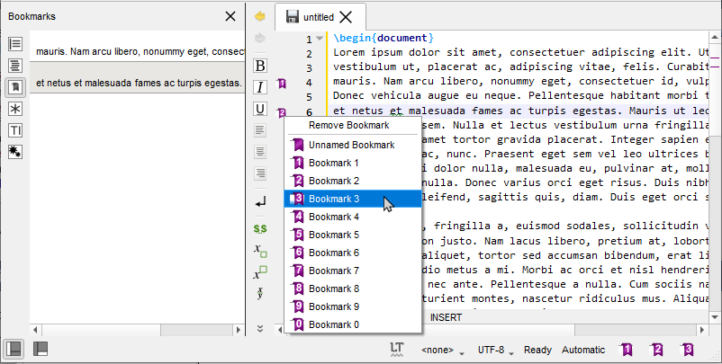

You may choose the Bookmarks view of the left side panel, which shows
the text for each line with a bookmark of all editors. With the ease of
a mouse click you can jump to the text line in the editor. A tooltip
shows the surrounding context of the line (s. left image below). The
lines are ordered in the order you created the bookmarks. A context menu
allows you to change the order of lines or remove bookmarks (s. right
image below).

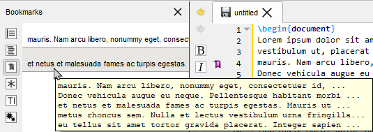  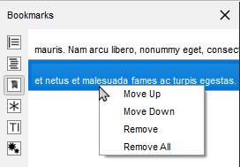

You probably noticed the three buttons (placed in the status line) on
the lower right side of the TeXstudio window, which look like bookmarks
1, 2, and 3 (s. image Bookmarks above). With a click you can jump to the
corresponding bookmark in the current editor. In fact this is a subset
of the actions you can find in the menu Edit/Goto Bookmark shown in the
following image in the middle. This menu also shows you the shortcuts
you can use (you may miss Ctrl+0 at the end of the list, but this
shortcut resets the zoom level of the editor). From the Edit/Go to menu
you can choose entry Line to jump to a line with a given line number.
You may want to use Previous mark or Next mark to find unnamed
bookmarks. For the sake of completeness it should be said that bookmark
is one of several types of markers (s. [The log files](compiling.md#the-log-files)).
You can toggle the bookmark of the line with the text cursor using the
actions from the menu Edit/Toggle Bookmark, which can be seen in the
following image on the right.


  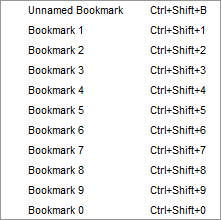


## Formatting your text

You can quickly set the format of a part of your text with this tool bar
:


**Additional option:** a selected text can be directly framed by certain
environments. Example: while clicking on the button \"Bold\" after
having selected the word \"Hello\" , you will obtain the code:
`\textbf{Hello}`.
This option is available for all the environments indicated by
\"\[selection\]\" in the \"LaTeX\" menu.

### Capitalisation

The menu \"Edit\" -\> \"Text Operations\" contains a few methods for
changing the capitalization of selected text:

-   To Lowercase
-   To Uppercase
-   To Titlecase (strict)
-   To Titlecase (smart)

Both variants of \"To Titlecase\" leave small words like a, the, of etc.
in lowercase. Additionally, \"To Titlecase (smart)\" does not convert
any words containing capital letters, assuming they are acronymes which
require a fixed capitalization (e.g. \"TeXstudio\").

### Escaping reserved characters

If you have text containing reserved TeX characters and want the text to
appear literally in your document, you have to escape the reserved
characters to prevent LaTeX from interpreting them. The following
functions take care of that (Menu: Idefix)

-   Paste to LaTeX: Takes the text from the clipboard and escapes
    reserved characters prior to pasting into the editor.
-   Convert to LaTeX: Escapes the reserved characters in the current
    selection.

For example: \"Less than 10% of computer users know the meaning of
\$PATH.\" will be converted to \"Less than 10\\% of computer users know
the meaning of \\\$PATH.\"

## Inserting a list

The usual list environments code can be insert quickly via the
\"LaTeX-List\" menu.
```{note}
The shortcut for the \\item command is `Ctrl+Shift+I`.
```

## Inserting a table

With the \"Tabular\" wizard (\"Wizard\" menu), the LaTeX code for a
tabular environment can be quickly inserted :

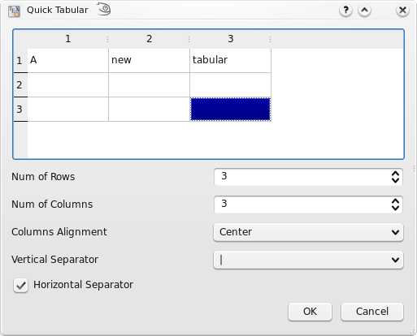

You can set the main features of your table.
Note : this dialog allows you to type directly the code in the cells.
The corresponding LaTeX code is automatically inserted in the editor.

### Manipulating tables

TeXstudio provides some commands to ease handling of tables. The
commands are located at LaTeX → Manipulate Table and in the Table
toolbar. Please be aware that some unexpected results may arise, if the
table constructing commands get too complex. Following commands are
offered:

-   Add Row after the current row
-   Remove Row: removes the table row in which the cursor
-   Add Column: add a column in the complete table after current cursor
    position. If the cursor is positioned at start of line,first column,
    the column is added as new first column.
-   Remove Column: remove current column
-   Add/Remove \\hline: add/remove `\hline` in all rows following the
    current row. If already a command `\hline` is present, no second
    command is placed.
-   Align Columns: Aligns the column separators (ampersand) by
    introducing whitespace. The text in the cells is aligned according
    to the specification in the table header. This helps reading the
    table source.
-   Remodel the table after a template. This allows one to force uniform
    table set-up in a document. Some templates are predefined, more can
    be added though it needs some programming in java script. This
    command is only present in the menu (math/tables)

TeXstudio also allows block cursors. Press \<Ctrl\>+\<Alt\>+\<Shift\>
and drag the cursor with the mouse. The block cursor works like a set of
normal cursors. You can copy and paste text as usual. Also you can type
in new text, which will be added in every row.


## Inserting a \"tabbing\" environment

To help you to insert a \"tabbing\" code, you can use the \"Tabbing\"
wizard (\"Wizard\" menu) :

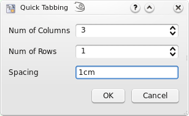

## Inserting a picture

To insert a picture in your document, just use the \"\\includegraphics\"
command in the \"LaTeX\" menu. Then, click on the \"browser\" button in
the dialog to select the graphic file.

Note : you can insert a \"figure\" LaTeX environment (\"LaTeX -
Environments\" menu) before inserting the picture.


### Inserting a picture using a \"wizard\"

Properly inserting figures is a challenge for LaTeX beginners and still
quite a bit of text to type for the expert. Therefore TeXstudio offers a
wizard for handling graphics insertion code in your document. \"Graphics
options\" defines the optional parameter of
`\includegraphics[options]{file}`. While the most used width/height
attributes can be easily set, alternatively you have full control with
the user defined setting.

Place the graphic inside a `figure` environment if it does not have to
be at an exact position in the text. Then LaTeX will determine an
optimal position on the page.

By pressing the \"Save as default\" button the current settings (except
file, caption and label) are stored and will hence be used as default
when you open the wizard.

The wizard also comes into play when you drag drop an image file to your
document or use copy in explorer and paste in TeXstudio. Together with
the adjustable default parameters this makes insertion of new pictures
very fast. Furthermore, if you start the wizard while the cursor is on
picture code, the wizard is used to manipulate the existing picture
settings.

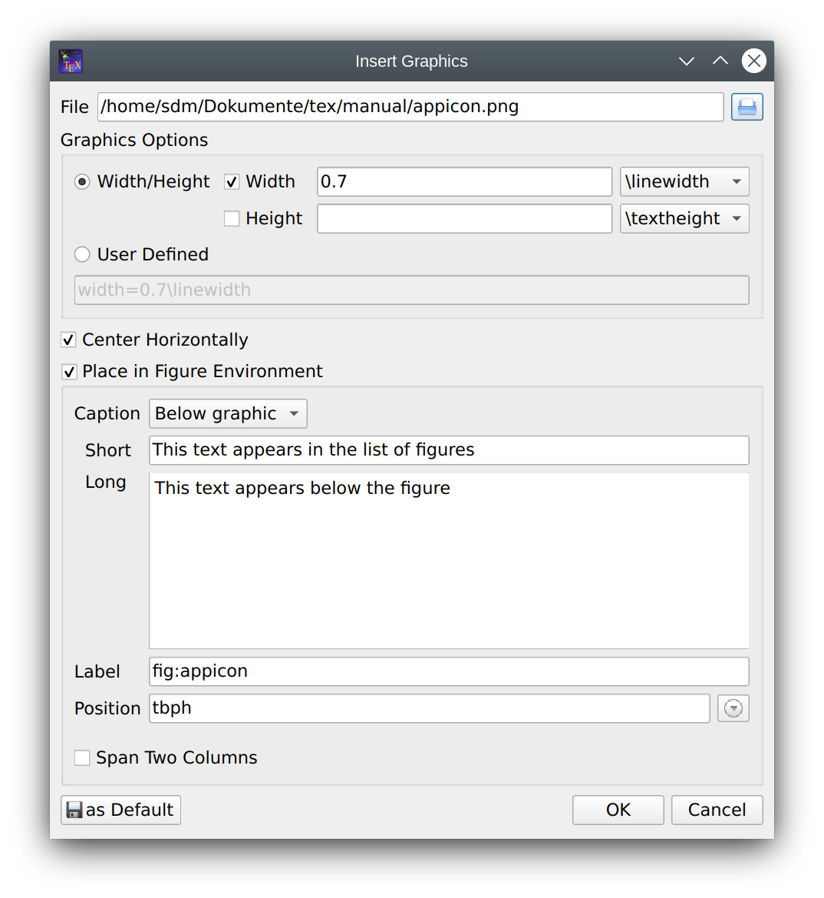

## Cross References and notes

This toolbox in the toolbar allows you to insert quickly the label,
cite, ref, footnote\... code.

```{note}
The labels used in your documents are displayed in the
\"Structure View\".
```


**Additional option:**for the \\ref command, a dialog box allows you to
select directly the label.

## Inserting math formula

You can toggle in the \"in-line math\" environment with the \"f(x)\"
button in the toolbar (shortcut : Ctrl+Alt+M) or with the \"Math\" menu.
The shortcut for the \"display math\" environment is : Alt+Shift+M.

The \"Math\" toolbar allows you to insert the most currents mathematical
forms (frac, sqrt\...) like the \\left and \\right tags.


With the \"symbols panels\" in the structure view, you can insert the
code of 400 mathematical symbols.

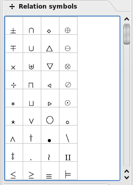

You can also define the format of your mathematical text via the
\"Math\" menu.

For the \"array\" environments, a wizard (like the \"Tabular\" wizard)
is available in the \"Wizard\" menu. With this wizard, you can select
the environment : array, matrix, pmatrix\.... The cells can be directly
completed.

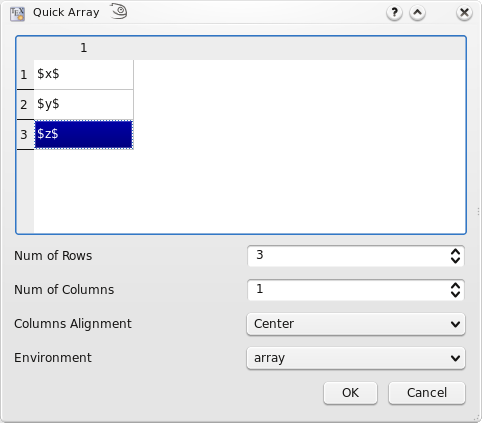

## Auto Completion

### Command completion

Whenever you press `\` followed by a letter, a list of possible LaTeX
tags is shown. If you type additional
letters, the list is filtered, so that only the tags starting with the
already written text are shown. If the list contains words which all
start with the same letter combination, you can press `Tab` to complete
all common letters. If only one element is present in the list, `Tab`
selects this one to do the completion, like `Enter`. This behaviour is
similar to tab completion in bash shells. You can also press `Ctrl+Space`
to open this completer whenever you want.

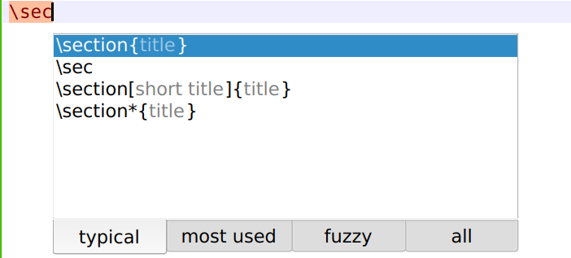

If a tag has different options, a short descriptive text is inserted
into your text, telling you the meaning of each option. You can press
`Ctrl+Left`, `Ctrl+Right` to select all positions.

If you change a command by completing a new command, only the command
name is substituted. The same is true for environments, where the
environment is changed in the `\begin`- and `\end`-command.

The completer has several operation modes which are shown in the tabs
below the command list.

-   Typical: list only typical commands and filter out rather unusual
    commands.
-   Most used: list only commands which have already been used in the
    completer by the user. This Is empty if txs has not been used before.
-   Fuzzy: search the command in a fuzzy way. The command needs to
    contain all given letters in the same order though with a arbitrary
    of letters between them. E.g. `\bf` lists, among others,
    \\**b**egin{**f**igure}
-   All: list all known commands.

### Text completion
Furthermore normal text can be completed by starting to type a word and
pressing `Ctrl+Space`. All appropriate words in the current document are
used as possible suggestions.

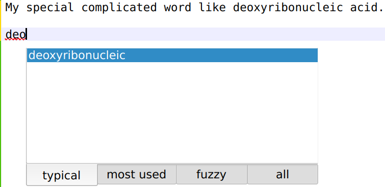

### Environment completion
If an environment is to be inserted, typing in the beginning of the
environment name and pressing `Ctrl+Alt+Space` gives suggestions for
adequate environments which are inserted completely with
`\\begin{env}..\\end{env}`.

```{tab} Entering env-name

```

```{tab} Completing env-name

```
### Reference/BibID completion
When entering reference commands, the completer offers those commands prefilled with potential references.

If a reference is changed or the command offers to enter several references, the completer can suggest  available references.

It works the same for *bibIDs*

```{tab} Reference command completion

```

```{tab} Reference completion

```


### KeyVal completion
TexStudio knows the possible keys and values for a number of commands.
The completer opens automatically when entering keys or pressing `,` to start the next key.
It also treats length specifially to offer only these when appropriate.

```{tab} Complete key

```

```{tab} Complete length value

```

### Filename completion
TexStudio can also complete filenames, mainly for `\include`- and `\includegraphics`-commands.

If the completer selection is on an image file, that image is previewed as a tooltip.

```{tab} File name completion

```

```{tab} File name completion with preview

```


### User tags completion
And finally, user tags can be assigned an abbreviation which can also be
used with completion. Just type in the start of the abbreviation and
start the completion with `Ctrl+Space`. The abbreviation should show up in
the completion list, especially marked with "abbreviation (Usertag)".
They can be defined in the [personal macros](advanced.md#personal-macros).
The abbreviation may start with a backslash (`\`) allowing autostart of the completer.

```{tab} Abbreviation

```

```{tab} Abbreviation starting with backslash

```


## Spell check
TexStudio checks the spelling as you type.
Right-click on the word to
open a menu with a list of possible corrections. In this context menu
you can also add the word to the ignore list. 


```{note}
If your dictionary is very
large (\> 5MB), opening the context menu and showing possible
suggestions can take some seconds. If you don\'t need the suggestion,
you can press shift while right clicking and don\'t have to wait.
```
The active language is shown at the bottom of the main window.
You can directly select a different language by clicking on the language code, see [also](configuration.md#configuring-the-spell-checker).


```{note}
More languages may be available in the configuation dialog, as txs filters the available language here to a predefined set plus all previously used languages.
```
The spell checking dialog, which can be open from the menu *tools/check spelling..* or with `CTRL+:`,
allows searching for these underlined spelling mistakes starting from the current cursor position.

Scrolls and selects the next misspelled word and offers suggestions to correct it. You may choose one of the suggestions, type something on your own in the `replace with field` or choose to ignore it.
`Adding` means to permanently add the found word as correct in the spell checker. The `Show User Words` button allows to check that list and also to remove mistakenly added words.

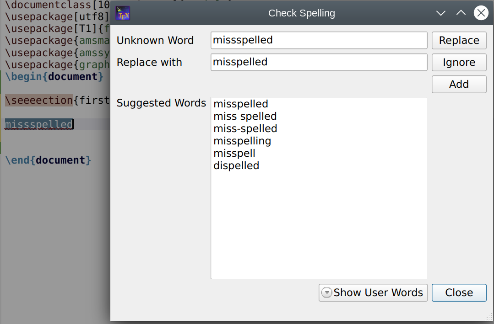
## Syntax check
TexStudio tries to determine if a command is correct by an internal list of valid commands.
It also tries to understand command context to some degree, so to see that math commands outside a math environment are not correct.


A tool tip on the error marking states the reason, why txs thinks that there is an error.

The supported error types are:

-   Unrecognized commands
-   Commands outside the proper environment, especially math-commands
-   Missing `\begin`/`\end` commands
-   Unrecognized key/value in some key/value options, e.g. `\includegraphics[*keyval option*]...`
-   Mismatch in defined/realized column number in tabular-like environments


```{caution}
LaTeX commands and especially LaTeX syntax are too complex to successfully check them completely.
Marked errors are probably real errors except in special environemts, but that does **not** guarantee an errror free document.
However the syntax marking may help to find issue significantly, especially in tabular environemnts.
```
## Thesaurus

TeXstudio has integrated a simple thesaurus. OpenOffice 2.x databases
are used for this. By placing the cursor on a word and activating the
thesaurus (`Ctrl+Shift+F8` or Edit/Thesaurus), it tries to find synonyms
for this word. Please be patient if you start the thesaurus at first
time since loading the database just occurs then and can take a few
moments.

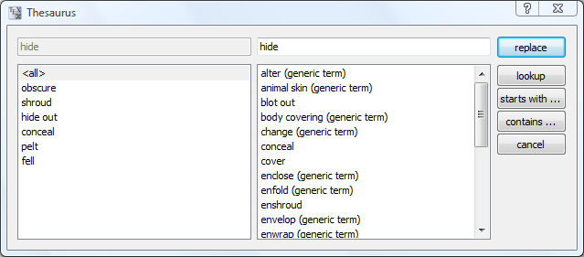

The first line to the left contains the word, for which a synonym is
searched for. The list below gives a list of word classes. The can be
chosen to reduce the number of suggestions. The column to the right
contains the list of suggested synonyms. A selected word from this list
apears in the first line to the right as proposition for replacement of
the text. This word can be changed manually. It is also used to do
further investigations for words and their synonyms which \"start with\"
or \"contain\" that word. With \"lookup\" it can be directly used to
look for a synonym for that word.

The thesaurus can be selected in the [configuration](configuration.md#configuring-the-thesaurus).

## Special Commands

### Delete word/command/environment

With the shortcut Alt+Del, the word under the cursor is deleted. If it
is a command, the command is deleted including opening and closing
braces. E.g. `\textbf{text}` leave `text`. If it is an environment,
the enclosing `\begin`/`\end` are removed.

### Rename environment

If you place the cursor on an environment name, after a moment a
mirror-cursor is activated on the environment name which allows
synchronous change of the environment name in the begin- and
end-command. So if you want to change a
`\begin{tabular}...\end{tabular}` construction to
`\begin{tabularx}...\end{tabularx}`, place the text cursor on
`tabular`, wait for a second and then, after the mirror-cursor
appears, change `tabular` to `tabularx`.

### Cut Buffer

If you select something and then start to type in a command and complete
it, the selection is put in as first argument. E.g. you have a `text`,
select it and start typing `\textbf`, command which is completed. The
resulting text is `\textbf{text}`.
